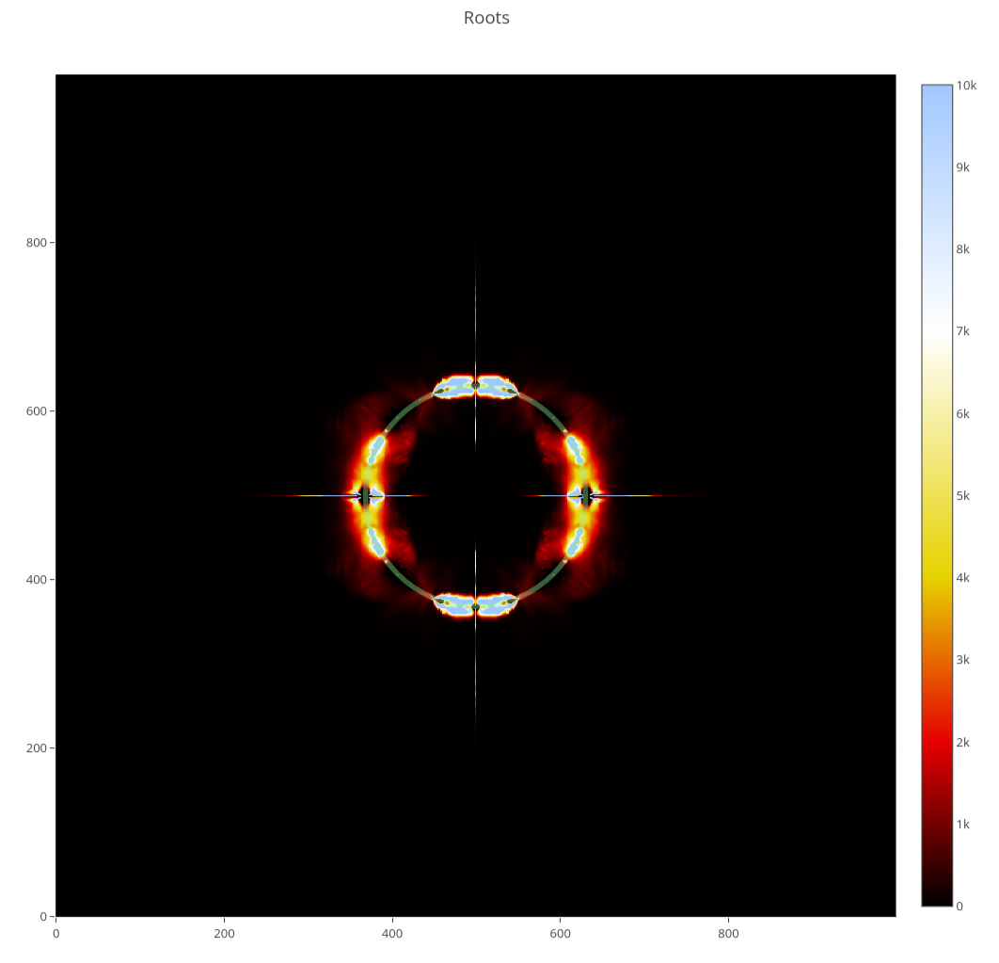

# Code and Erratum for *Big data comparison of quantum invariants*

We collected a bit of data and other things relevant for the paper *Big data comparison of quantum invariants*
<a href="https://arxiv.org/abs/2503.15810">https://arxiv.org/abs/2503.15810</a> on this page.

An Erratum for the paper *Big data comparison of quantum invariants* can be found at the [bottom of the page](#erratum).

## Contact

If you find any errors in the paper *Big data comparison of quantum invariants* **please email us**:

[dtubbenhauer@gmail.com](mailto:dtubbenhauer@gmail.com?subject=[GitHub]%web-reps)

[victor.l.zhang@unsw.edu.au](mailto:victor.l.zhang@unsw.edu.au?subject=[GitHub]%web-reps)

Same goes for any errors related to this page.

## Interactive webpage

It is much more fun to see the data in interactive plots: [Click](https://dustbringer.github.io/web--knot-invariant-comparison)

On that side one can find statistics, roots plots and ballmapper plots.




## Javascript for B1 computation

Our Javascript script to calculate the B1 invariant is available at `/scripts/evaluator`. See [this page](md/javascript-script.md) for more details for how to run it.

## Data files
This repository contains the list of knots (up to 16 crossings) used (from [KnotInfo](https://knotinfo.math.indiana.edu/homelinks/database_download.php)), the list of calculated invariants,
a few statistics (as in the paper), colors for the ballmapper, and data used to generate the ballmapper and roots on the interactive website. Data up to 18 crossings is >50GB so is not included in this repository.

The current ballmapper data is `bm.Graph.edges` and `bm.points_covered_by_landmarks` computed using [pyBallMapper](https://github.com/dioscuri-tda/pyBallMapper) with parameters mentioned in the paper.
The current ballmapper visualization is built using `d3` and `d3.force` javascript plotting libraries.
The legacy ballmapper visualization is calculated with code based off [Davide Gurnari's mapper visualisation code](https://github.com/dgurnari/mapper_maps).

All data mentioned can be downloaded above. Since the files are fairly large, they are compressed to `.7z` files and can be easily extracted.


## How we calculated everything
The main calculations ran on the [Katana](https://docs.restech.unsw.edu.au/using_katana/about_katana/) cluster of UNSW.

It took about _4 months_ to complete, with almost all of the time needed for the B1 invariant.

### Katana Cluster Overview

Katana is a shared computational cluster located at UNSW, designed for non-sensitive data research. It provides easy access to computational resources for projects that exceed the capabilities of desktop or laptop systems. Below is an overview of its features and configuration.

Key Features:
- **Over 6,000 CPU cores** across heterogeneous hardware (Dell, Lenovo, Huawei).
- **8 GPU Compute Nodes**:
  - Tesla V100-SXM2, 32GB.
  - Nvidia A100, 40GB.
  - Five nodes are department-dedicated, while three are for general use.
- **6 PB of Disk Storage**.
- Flexible compute environment supporting jobs with long walltime limits:
  - 12, 48, 100, 200-hour queues with prioritization.
- Training and support are available for new users or researchers uncertain about using High-Performance Computing (HPC).

System Configuration:
- **OS**: RPM-based Linux (Rocky 8 on management plane and nodes).
- **Scheduler**: OpenPBS version 23.06.06.
- **Scratch Storage**:
  - Global scratch at `/srv/scratch`.
  - Local scratch available at `$TMPDIR`.

Compute Resources:
- **Roughly 170 nodes**:
  - Heterogeneous CPU configurations for diverse compute needs.

GPU Compute:
- **Eight GPU Nodes**:
  - High-memory GPUs (V100-SXM2 and A100).
  - Dedicated and general-use configurations for flexibility.

Advanced Use:
Katana serves as a training or development base before transitioning to systems like Australia’s peak HPC system, Gadi at NCI. Research Technology Services provide guidance and training for effective use of HPC resources.

For detailed specifications of compute nodes, refer to the full compute node information section.

## Average runtime

There were two calculation clusters involved.

### Not B1 Javascript

Except the Javascript program, the average runtime was computed on the following system. The data below was created with

```
uname -a
lscpu
lsblk
free -h
```
and therefore contains some redundant information.

Operating System:
Linux dani-yoga 6.8.0-52-generic #53-Ubuntu SMP PREEMPT_DYNAMIC Sat Jan 11 00:06:25 UTC 2025 x86_64 x86_64 x86_64 GNU/Linux

CPU Information:
- Architecture: x86_64
- CPU op-mode(s): 32-bit, 64-bit
- Address sizes: 46 bits physical, 48 bits virtual
- Byte Order: Little Endian
- Vendor ID: GenuineIntel
- Model Name: Intel(R) Core(TM) Ultra 7 155H
- CPU Family: 6
- Model: 170
- Stepping: 4
- Threads per Core: 2
- Cores per Socket: 16
- Socket(s): 1
- BogoMIPS: 5990.40
- CPU Max MHz: 4800.0000
- CPU Min MHz: 400.0000

Cache Information:
- L1d Cache: 544 KiB (14 instances)
- L1i Cache: 896 KiB
- L2 Cache: 18 MiB
- L3 Cache: 24 MiB

Flags:
fpu vme de pse tsc msr pae mce cx8 apic sep mtrr pge mca cmov pat pse36 clflush dts acpi mmx fxsr sse sse2 ss ht tm pbe syscall nx ...

Memory Information:
- Total RAM: 15 GiB
- Used: 3.6 GiB
- Free: 8.4 GiB
- Shared: 1.0 GiB
- Swap: 4 GiB (unused)

Disk Information:
- Primary Disk Size: 953.9 GiB
- Boot Partition: 1 GiB
- Root Partition: 952.8 GiB

Virtualization:
- Technology: VT-x

Vulnerability Mitigations:
All major vulnerabilities (e.g., Spectre, Meltdown) are mitigated or not affected.

### B1 Javascript

The Javascript program for the B1 invariant was run on the Katana as above.

# Erratum

Empty so far.
