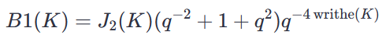
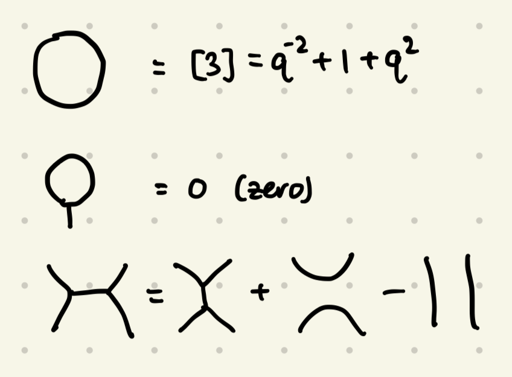
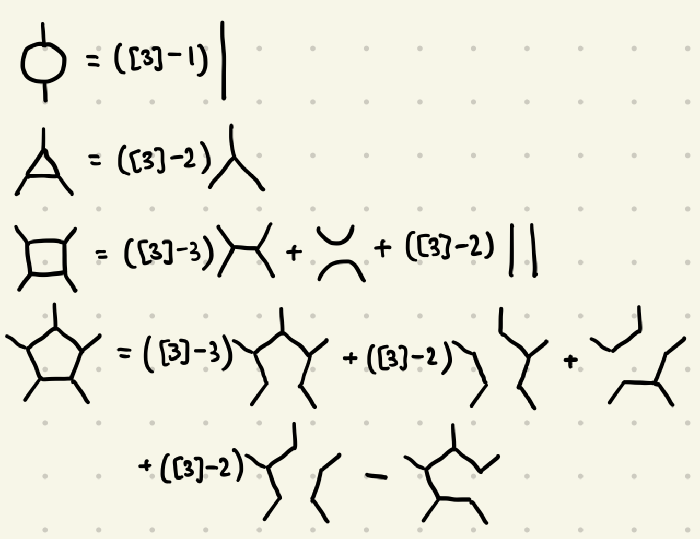
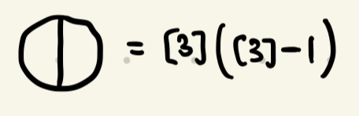
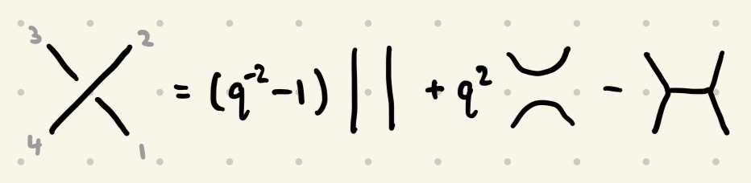
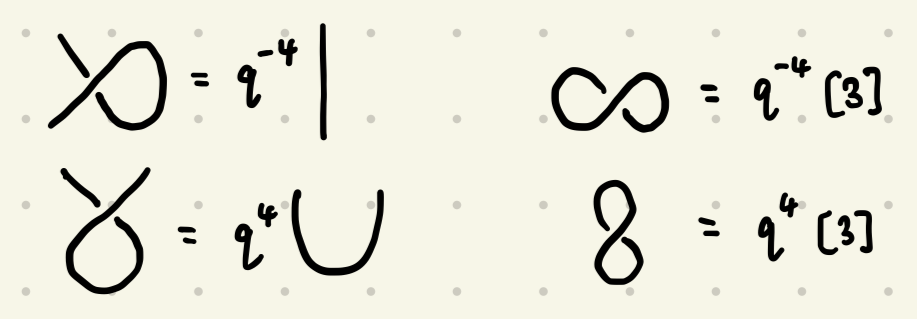

# B1 Javascript Details

The script is found at `/scripts/evaluator`

## Installation

The script runs on NodeJS using the `pnpm` package manager.
- NodeJS and `npm` (the basic package manager) can be installed by following instructions on [this website](https://nodejs.org/en/download).
  - The script was written using `node` version `v20.17.0`. Any newer version should work fine; if you want to be safe you can install any of the `v20.xx.x` versions.
- If you installed `node` using a prebuilt binary, you may also have to install `pnpm` via [this website](https://pnpm.io/installation), for example using `corepack`.
  - For those feeling this is too complicated, all the following can be done without `pnpm`, just replace `pnpm` with `npm` in all instructions that follow.

After installing, open a terminal in the `/scripts/evaluator` folder and run `pnpm install` to install the dependencies.

Extract the list of knots `PD_3-16.txt` into `/scripts/evaluator/data` (this is where the script looks for the knots by default).


## Script Overview

### Running and Output
To run, run `pnpm run r [start] [end]` in the `/scripts/evaluator` folder.
- Here, `start` and `end` are indices in the `PD_3-16.txt` file, indexing from 0 (the first knot is 0).
- The script will calculate knots from `start` to `end` inclusive, and create an output file in the `/scripts/evaluator/data` folder. The output file is created sequentially for each knot, so first computations are preserved if the script is terminated prematurely.
  - For example `pnpm run r 100 105` will calculate knots 100,101,102,103,104,105.

The output is a polynomial in the form of a JSON object (one on each line). For example
```
{"-2":2, "-1":-1, "0":3, "1":1, "2":7}
```
is the polynomial `2*q^-2 - q^-1 + 3 + q + 7*q^2`. This is also the form which the data in this repository is stored.

**Warning!** The output polynomial of the script must be multiplied by `q^{4*writhe(K)}` for each knot `K`. The writhes of the knots can be calculated or found in the file `/knots/writhe-3-16.txt`. The output of the program is related to the 2-coloured Jones polynomial as follows.


### What is actually being run?
The main calculation scripts are in `/scripts/evaluator/modules`
- `knots`
  - `evaluate-q-knot.ts`: code that evaluates the knots; the main function is `evaluateKnot`. This uses `evaluate-poly.ts` to deal with polynomials, and runs `evaluate-q.ts` after reducing knots to a linear combination of trivalent graphs.
  - `process-knot-file.ts`: helper function to extract the PD from the KnotInfo list
- `evaluate-poly.ts`: an implementation of polynomials in Javascript, along with not-really-polynomial "coefficients" to speed up calculation
- `evaluate.ts`: evaluates trivalent graphs (as SO(3) webs)
- `evaluate-q.ts`: evaluates trivalent graphs (as SO(3) webs; quantum version)
- `evaluate-q-new.ts`: should be the same as `evaluate-q.ts`, but uses a similar technique as in `evaluate-q-knot.ts` to speed up calculation
  - We never ended up using this, so it was not tested completely. There may be some bugs.

The file `index.ts` is a gateway to "the main stuff". It essentially parses user input, runs `evaluateKnot` from `evaluate-q-knot.ts` on the right knots, parses it's output into something comprehensible and writes it to a file.

### What are these "coefficients"?
> The relations shown in this section should be consistent with Section 5 of [this paper](https://arxiv.org/abs/2307.00785).

The local (B1) web relations on trivalent graphs, used in `evaluate-q.ts`, `evaluate-q-new.ts` and `evaluate-q-knot.ts`, are the following.

- The first line is `circle`
- The coefficients of the last two terms in the last is are `ihx2` and `ihx3`

From these we can calculate the first few "face-reduction" relations.

- The coefficients of the right hand sides are `c2x1`, `c3x1`, `c4x0`, `c4x1`, `c4x2`, `c5x0`, `c5x1`, `c5x2`, `c5x3`, `c5x4` in the order they appear.

In the calculation of these webs, the program can't see circles. So we need to calculate the most primitive non-circle trivalent graph.

- This is `c2x1Circle`.

For knots, the local relation, used in `evaluate-q-knot.ts`, is as follows.

- The coefficients of the right hand side are `c1`, `c2`, `c3` respectively.

From these we have "untwists", and minimal non-circle knots (that look like infinity).

- The coefficients on the top row are `cUntwist1` and `cUntwist1Circle`.
- The coefficients on the bottom row are `cUntwist2` and `cUntwist2Circle`.

### Algorithm Strategy
Naively, we may use the following recursive algorithm for applying Skein relations. First enumerate all the places where the relation can be applied.
Take the best one of these and apply the relation. For each new knot/graph, recursively run this algorithm.

Indeed this will take an exponential number of steps. This strategy is applied in `evaluate.ts` and `evaluate-q.ts` by choosing the smallest "face" in a trivalent graph, and applying the appropriate face reduction algorithm.

To speed this up, we can use an iterative approach by storing all the recursion "branches" and applying some reductions between applications of the relation.
This strategy is employed in `evaluate-q-new.ts` and `evaluate-q-knot.ts`. In between applying relations, equal knots/graphs are grouped together
and simple features of each knot/graph are ironed out (for example: removing twists in knots, reducing faces whose relation only have one term).

After we have applied all the relations that we can, we are left with something that can be evaluated to a polynomial.
Some parts of the algorithm store lists of "coefficients" which need to be expanded out into a real polynomial.
The corresponding polynomials are stored in the variable `basicPolys` of the file `evaluate-poly.ts`, and a function like `coeffsToPolyMemoize` is used to replace each coefficient
with the corresponding polynomial. We use memoization so that previously calculated powers of coefficients do not need to be calculated again, yet again to save time.

### Memory limit!
By default, V8 (the engine used by NodeJS) has a 4GB memory allocation limit. For larger knots/graphs, more memory is needed.
In this situation, one can instead run `pnpm run r-mem [start] [end]` to raise this limit to 16GB. If your device's memory is less than this, it will still work.

You can change the limit of `r-mem` in the `/scripts/evaluator/package.json` file, under `scripts`.


## The Miscellaneous Scripts
There is another folder included: `/scripts/evaluator/scripts`. These are just scripts that were used to generate the data.
They can be run with `pnpm run ts-node scripts/[name-of-script]` with a terminal in the `/scripts/evaluator` folder (this is important).
These scripts have not been edited for upload, so there are artefacts of how files were once stored (eg. invariants stored in `../../`) and some parts are not up to date. Please read through and edit them before trying to use them.

Again, to use more memory, write `pnpm run ts-node-mem ....` instead.


